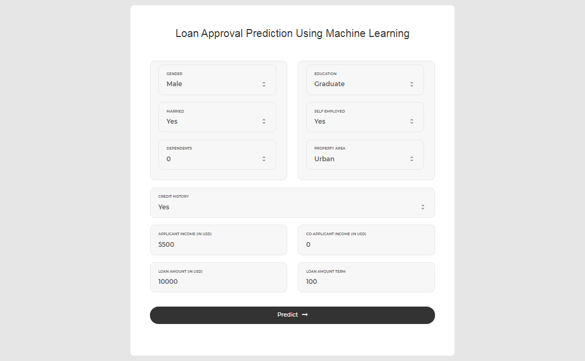
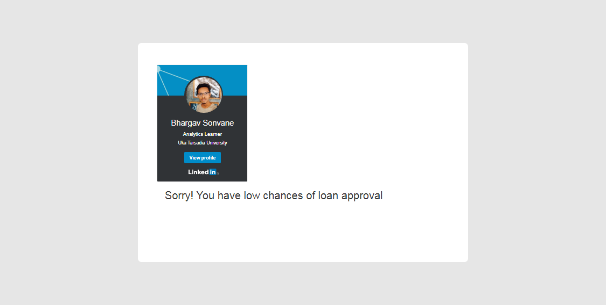

<p>
  <a href="https://www.linkedin.com/in/bhargavsonvane/" target="_blank">
   
 </a>
  <a href="https://opensource.org/licenses/MIT" target="_blank">
   
 </a>
</p>

# ML Loan Prediction App Powered by Google Kubernetes Engine
- A project that helps you to deploy Flask App on Google Kubernetes Engine. 
- User enters the required loan details and can get the predictions of his loan approval.
- Logistic Regression model is used for this classification project and is deployed to 
GKE.

# Dockerize the Flask App
- We need to to dockerize the Flask app before deploying it to Google Kubernetes Engine. 
- Create new file called Dockerfile and add the following configuration:

```
FROM python:3.6-jessie
RUN apt update
WORKDIR /app
ADD requirements.txt /app/requirements.txt
RUN pip install -r /app/requirements.txt
ADD . /app
ENV PORT 8080
CMD ["gunicorn", "app:app", "--config=config.py"]

```
Build the docker image on Google Cloud Platform, using the following command:
```
gcloud builds --project YOUR_PROJECT_NAME \
    submit --tag gcr.io/YOUR_PROJECT_NAME/loanml:v1 .
```


# Deploy to Google Kubernetes Engine
## First of all, make sure you have access to the Kubernetes cluster. 
## To deploy to Kubernetes, create new deployment configuration called app.yaml and add the following:
```
apiVersion: apps/v1beta2
kind: Deployment
metadata:
  name: loan-approval-predictor
  labels:
    name: loan-approval-predictor
spec:
  replicas: 1
  selector:
    matchLabels:
      name: loan-approval-predictor
  template:
    metadata:
      name: loan-approval-predictor
      labels:
        name: loan-approval-predictor
    spec:
      containers:
        - name: loan-approval-predictor
          image: gcr.io/bhargavsonvane/loanml:v1
          ports:
            - containerPort: 8080
          resources:
            requests:
              memory: 256Mi
            limits:
              memory: 512Mi
          env:
            - name: DEBUG_MODE
              value: "1"
```
Deploy to Flask app to the kubernetes cluster using the following command:

```
kubectl apply -f app.yaml
```

Expose the port using the following command:

```
kubectl expose deployment loan-approval-predictor \
    --type=LoadBalancer --port 80 --target-port 8080
```

You an get the deployed Flask app URL using the following command:

```
kubectl get services -l name=loan-approval-predictor
```
You will get the internal and external IP. If you want to access the Flask app outside kubernetes cluster you can use the external IP.
The next step is to enable auto-scaling using the following command:

```
kubectl scale deployment loan-approval-predictor --replicas=NUMBER
kubectl autoscale deployment loan-approval-predictor \
    --min=NUMBER --max=NUMBER \
    --cpu-ratio=FLOAT --replicas=NUMBER
```
If you want to re-deploy, you need to build the new image then run the following command:

```
kubectl set image deployment/flask-app-tutorial \
    flask-app-tutorial=NEW_IMAGE_TAG
```
Done.
- Input
<p align="center">

</p>


- Output
<p align="center">

</p>
